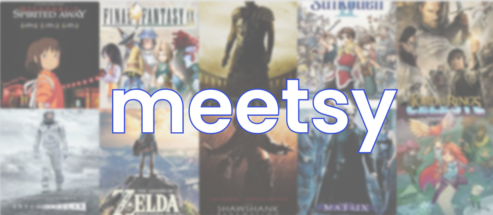
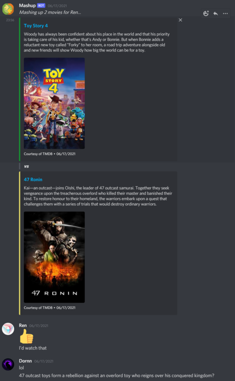
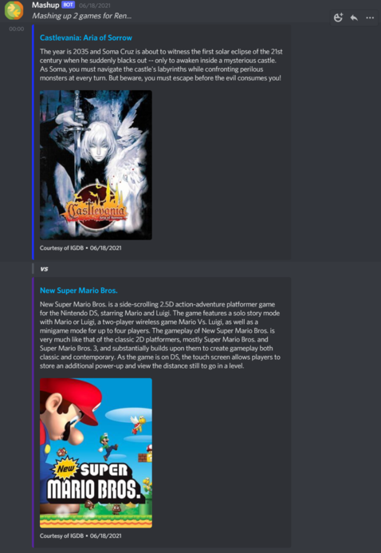

    
  
  <h1 align="center">
    Meetsy - a Discord bot that inspires story creativity
     
  </h1>

  

  What would the movie look like where O Brother, Where Art Thou meets Erin Brockovich? You may never have pondered this question before, but now you can. Mashup will randomly take multiple movies (or games) and outputs them to your channel. Inspire a fun, creative conversation as everyone comes up with a brand new movie!
     
  

  

   <strong>DiscordJS</strong> &nbsp  &nbsp; &nbsp; <strong>NodeJS</strong> &nbsp;  &nbsp; &nbsp; 
  

   
  

      
    
    
  

  

  

 

## Table of Contents
- [Table of Contents](#table-of-contents)
- [Installation](#installation)
  - [Requirements](#requirements)
  - [Steps](#steps)
- [Features](#features)
- [Upcoming Features](#upcoming-features)
- [FAQ](#faq)
  - [I have an idea for other types of mashups - do you take feature requests?](#i-have-an-idea-for-other-types-of-mashups---do-you-take-feature-requests)
  - [I'm having problems getting the API keys for TMDB or IGDB. Can you help?](#im-having-problems-getting-the-api-keys-for-tmdb-or-igdb-can-you-help)
  - [I would like to use a different service other than TMDB or IGDB. Is this possible?](#i-would-like-to-use-a-different-service-other-than-tmdb-or-igdb-is-this-possible)
  - [I mostly like what you've done, but I want to tweak a few things. Can I fork this and use it myself?](#i-mostly-like-what-youve-done-but-i-want-to-tweak-a-few-things-can-i-fork-this-and-use-it-myself)
  
## Installation
 

### Requirements

- [**IGDB**](https://api-docs.igdb.com/#about) API access
- [**TMDB**](https://www.themoviedb.org/documentation/api) API access
- A server or computer to host the bot

### Steps

1. To be honest, I'm not sure if I could explain any better than the group over at [DiscordJS](https://discordjs.guide/preparations/setting-up-a-bot-application.html). Follow the guides on setting up the bot application and how to add a bot to your server - they're excellent and will get you set up in no time at all.

2. You will need access to the Developer APIs for [**IGDB**](https://api-docs.igdb.com/#about) and [**TMDB**](https://www.themoviedb.org/documentation/api). Ultimately you just will need the appropriate keys and tokens to GET data from their servers.

3. There is a `.env.sample` for you to fill out with the relevant information and then rename to `.env`.

## Features

- Movie mashups!
   
  
- Game mashups
   
  

## Upcoming Features

- An AI driven speech bot that makes the whole experience more game-like. If everyone could join a channel, the AI passes the story baton to someone or adds a story beat itself before moving on. After an alloted amount of time the story ends and you have a community driven beat for beat plotline of a brand new movie.
- Some way to compile greatest hits that people have discovered and what kind of stories their groups came up with.
- Game meets movie or movie meets game. No reason to keep it in their respective mediums. A story is a story no matter what form!
  
## FAQ

### I have an idea for other types of mashups - do you take feature requests?

> Sure! If it's something you really want, I encourage you to either fork this or make a pull request and I will take a look at merging any changes. Otherwise feel free to make a pull request just explaining the new feature and why you think it would be a great idea and I would love to see if I can include it in a future build!

### I'm having problems getting the API keys for TMDB or IGDB. Can you help?

> I can certainly try if you shoot a pull request my way. No guarantee I will be able to diagnose the problem though and it's perhaps a quicker solution to contact the respective company themselves.

### I would like to use a different service other than TMDB or IGDB. Is this possible?

> The application is fairly tied into the data structure that is retrieved from those services. It might take some work to adapt it to others. Perhaps in a future build I can decouple this and make it easier to adapt given any changes by either of those companies to their API services. Basically it's certainly possible, but may take some refactoring.

### I mostly like what you've done, but I want to tweak a few things. Can I fork this and use it myself?

> Of course you can! I initially made this tool primarily for myself, but have released it to the wild to help anyone. Take it, change it, morph it and squash it to your heart's desire.
